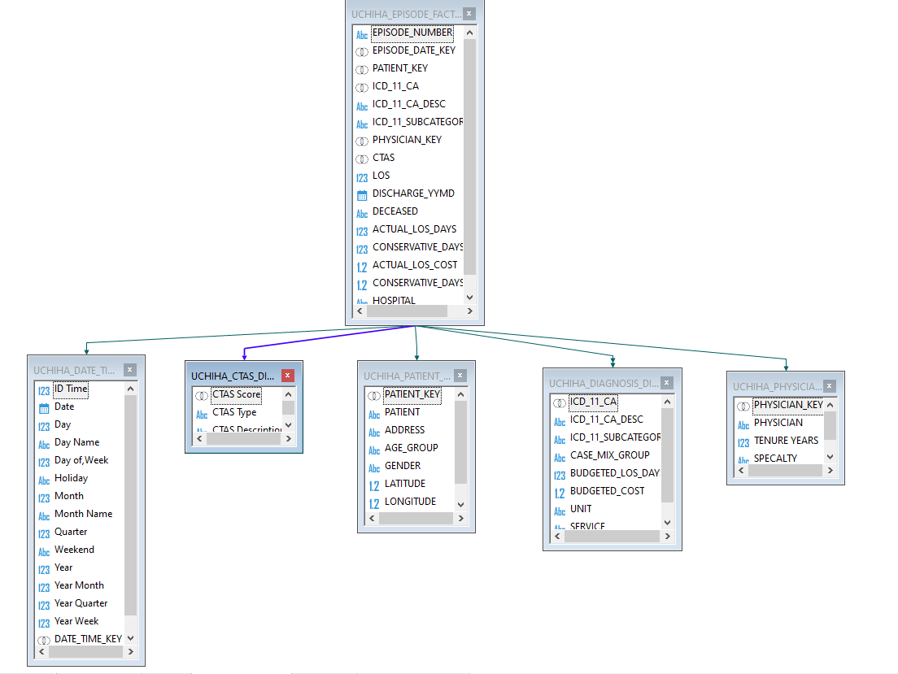
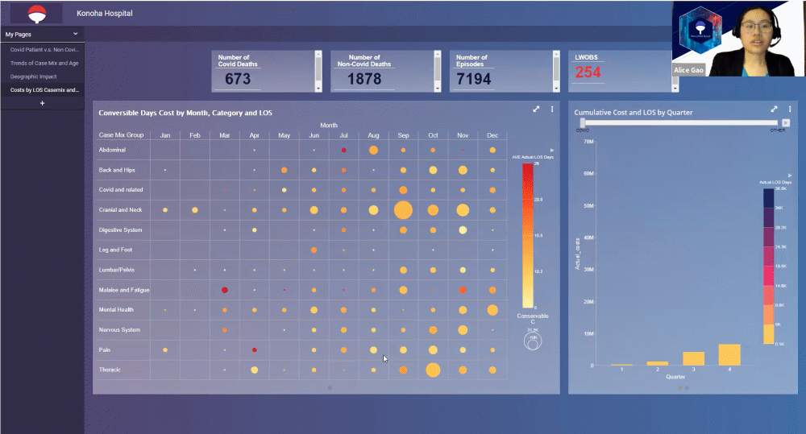

# SymposiumDashboard
This dashboard was created in a team effort to create usable insights addressing the drastic changes in a local health system from Covid-19. The main PowerPoint presentation of it, a sample of its relational structure, and my segment of the dashboard presentation are accessible in this repository.

The data for this dashboard is based on anonymized encounters from three locations in the GTA area, and our group was tasked with collectively deciding 10 insight aims, taking the raw data, putting it in a proper relational database structure, uploading it to Information Builders Web focus environment and manipulating it to create our dashboard.
After deciding our group objective was to help the CFO make better decisions for budgeting, resource allocation, and decision support, we followed through a stakeholder analysis and SWOT analysis of the major components and began the process of massaging the raw data for our analysis.

I created the Star schema for the project linking together the major data repository and details of each encounter as shown below.

After which we each concentrated on an aspect of data visualization that would serve the CFO audience, cleaning our data for any errors and testing through mockups dry runs. For the page of the dashboard I created, I concentrated on comparing Average LOS compared to the case-mix group, data could be then drilled down monthly to see which departments are saving money because of earlier discharge and which ones are spending more because of later discharge. Additionally, I also worked on including quarter summaries of cost of the death of patients, for covid related complications and not, as further expanding the top at a glance numbers for the institution’s performance. 

This dashboard was a finalist for Conestoga’s annual Public Health and Health Informatics Symposium in 2021, and it was a very rewarding experience to apply my database knowledge, manipulation, and analysis skills.

# Disclaimer
All data have been anonymized for the use of the project, and no identifying information is available through our BI dashboard presentation.
